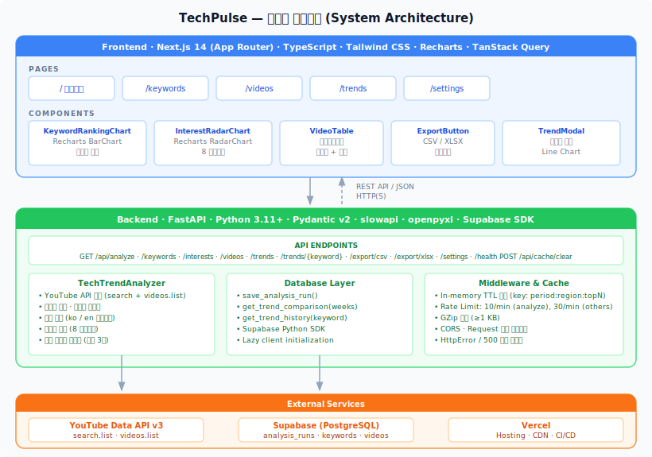
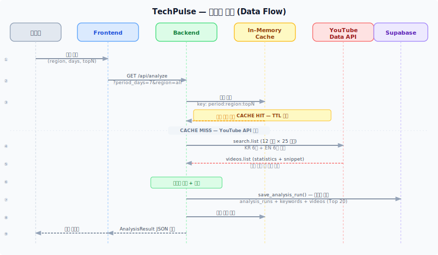
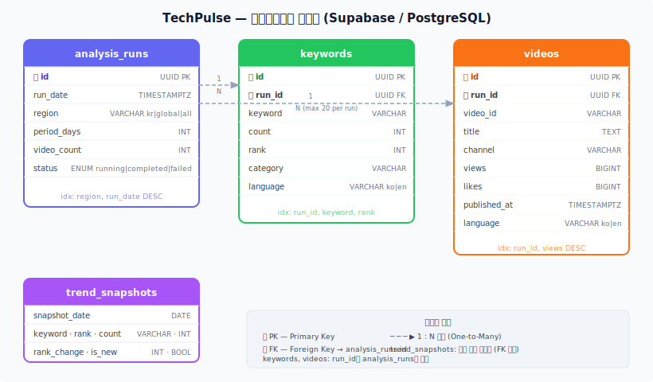

# TechPulse — YouTube 테크 트렌드 분석기

> YouTube Data API v3 기반 테크 리뷰 트렌드 분석 대시보드



---

## 주요 기능

| 기능 | 설명 |
|------|------|
| **키워드 TOP 10 분석** | 영상 제목·태그·설명에서 키워드 추출, 빈도 기반 랭킹 |
| **관심사 카테고리 분류** | 8개 테크 카테고리(스마트폰, AI, 노트북 등) 자동 분류 |
| **한국/글로벌 이중 지원** | KR 6개 + EN 6개 쿼리로 언어별 트렌드 분리·통합 |
| **트렌드 추적** | 분석 이력 저장 → 주간 순위 변동(▲▼) 비교 |
| **CSV / XLSX 내보내기** | 키워드·영상 데이터 다운로드 |
| **다크모드** | 시스템 테마 연동 + 수동 토글 |

---

## 기술 스택

**Backend**
- Python 3.11+ · FastAPI · Pydantic v2
- YouTube Data API v3 · Supabase (PostgreSQL)
- slowapi (Rate Limiting) · In-memory TTL 캐시

**Frontend**
- Next.js 14 (App Router) · React 18 · TypeScript
- Tailwind CSS · Recharts · TanStack Query

**Deployment**
- Vercel (Frontend) · Uvicorn (Backend)

---

## 빠른 시작

### 사전 준비

[Google Cloud Console](https://console.cloud.google.com/)에서 YouTube Data API v3를 활성화하고 API 키를 발급받으세요.

### 1. 환경변수 설정

```bash
cp .env.example .env
# .env 에 YOUTUBE_API_KEY 입력
```

<details>
<summary>.env 항목 설명</summary>

```env
# 필수
YOUTUBE_API_KEY=your_youtube_data_api_v3_key

# Supabase — 트렌드 추적 기능 (선택)
SUPABASE_URL=https://your-project.supabase.co
SUPABASE_KEY=your_supabase_anon_key
DB_ENABLED=false

# 선택 (기본값 사용 가능)
CACHE_TTL_SECONDS=300
CORS_ORIGINS=http://localhost:3000
LOG_LEVEL=INFO
```

</details>

### 2. Backend 실행

```bash
cd backend
python -m venv venv
source venv/bin/activate      # Windows: venv\Scripts\activate
pip install -r requirements.txt
uvicorn app.main:app --reload --port 8000
```

API 문서 (Swagger): http://localhost:8000/docs

### 3. Frontend 실행

```bash
cd frontend
npm install
echo "NEXT_PUBLIC_API_URL=http://localhost:8000" > .env.local
npm run dev
```

대시보드: http://localhost:3000

---

## 프로젝트 구조

```
youtube-tech-trend-analyzer/
├── backend/
│   ├── app/
│   │   ├── main.py          — FastAPI 앱 + API 엔드포인트 + 미들웨어
│   │   ├── analyzer.py      — TechTrendAnalyzer (핵심 분석 엔진)
│   │   ├── database.py      — Supabase 연동 (트렌드 저장)
│   │   ├── models.py        — Pydantic 데이터 모델
│   │   └── config.py        — 환경변수, 검색 쿼리, 카테고리 설정
│   └── tests/
│       ├── test_analyzer.py
│       └── test_api.py
├── frontend/
│   └── src/
│       ├── app/             — Next.js 페이지
│       │   ├── page.tsx         (대시보드)
│       │   ├── keywords/        (키워드 상세)
│       │   ├── videos/          (영상 목록)
│       │   ├── trends/          (트렌드 비교)
│       │   └── settings/        (설정)
│       ├── components/      — UI 컴포넌트
│       │   ├── KeywordRankingChart.tsx
│       │   ├── InterestRadarChart.tsx
│       │   ├── VideoTable.tsx
│       │   ├── SummaryCards.tsx
│       │   ├── ExportButton.tsx
│       │   └── TrendModal.tsx
│       └── lib/
│           ├── api.ts           — API 클라이언트 + TypeScript 타입
│           └── QueryProvider.tsx
├── docs/
│   ├── PRD.md               — 제품 요구사항 문서
│   ├── architecture.md      — 아키텍처 상세 문서
│   └── diagrams/
│       ├── system-architecture.svg
│       ├── data-flow.svg
│       └── db-schema.svg
└── analyzer.py              — 독립 실행 스크립트 (레거시)
```

---

## API 레퍼런스

베이스 URL: `http://localhost:8000`

| 메서드 | 경로 | Rate Limit | 설명 |
|--------|------|------------|------|
| GET | `/api/analyze` | 10/min | 전체 분석 실행 (캐시 우선) |
| GET | `/api/keywords` | 30/min | 키워드 TOP N |
| GET | `/api/interests` | 30/min | 관심사 카테고리 점수 |
| GET | `/api/videos` | 30/min | 조회수 상위 영상 (페이지네이션) |
| GET | `/api/trends` | 30/min | 주간 키워드 순위 비교 |
| GET | `/api/trends/{keyword}` | 30/min | 키워드 이력 조회 |
| GET | `/api/export/csv` | 30/min | CSV 다운로드 |
| GET | `/api/export/xlsx` | 30/min | XLSX 다운로드 |
| GET | `/api/settings` | 30/min | 현재 설정 조회 |
| GET | `/api/health` | 30/min | 헬스 체크 + 캐시 상태 |
| POST | `/api/cache/clear` | 30/min | 캐시 초기화 |

**공통 파라미터:** `period_days` (1–30, 기본 7) · `region` (kr/global/all) · `top_n` (1–50, 기본 10)

---

## 문서

| 문서 | 설명 |
|------|------|
| **[API Reference](docs/API_REFERENCE.md)** | 전체 API 엔드포인트 상세 문서 (요청/응답 스키마, 에러, Rate Limit) |
| **[Configuration Guide](docs/CONFIGURATION.md)** | 환경변수 설정 가이드 (Backend + Frontend) |
| **[Troubleshooting](docs/TROUBLESHOOTING.md)** | 자주 발생하는 문제와 해결 방법 |
| **[Architecture](docs/architecture.md)** | 시스템 아키텍처 상세 문서 |
| **[PRD](docs/PRD.md)** | 제품 요구사항 문서 |
| **[Deployment](docs/DEPLOYMENT.md)** | 배포 가이드 |

---

## 아키텍처

자세한 내용은 **[docs/architecture.md](docs/architecture.md)** 참조.

### 데이터 흐름

```
사용자 필터 선택
  → GET /api/analyze
  → 캐시 HIT?  ──→ 즉시 반환
  → 캐시 MISS
      → YouTube search.list (KR×6 + EN×6 쿼리, 각 25개)
      → YouTube videos.list (중복 제거 후 상세 조회)
      → 키워드 추출 + 불용어 필터 + 관심사 분류
      → Supabase 비동기 저장 (실패해도 응답에 무영향)
      → 캐시 저장 → AnalysisResult JSON 반환
```



---

## 데이터베이스 스키마

트렌드 추적 기능에는 Supabase 연결이 필요합니다 (`DB_ENABLED=true`).



**테이블:** `analysis_runs` · `keywords` · `videos` · `trend_snapshots`

---

## 테스트

```bash
cd backend
pytest tests/ -v

# API 헬스 체크
curl http://localhost:8000/api/health
```

---

## 개발 로드맵

| Phase | 상태 | 내용 |
|-------|------|------|
| Phase 1 | ✅ 완료 | 키워드 분석 + 대시보드 + 내보내기 + 글로벌 지원 |
| Phase 2 | 🚧 진행 중 | Supabase 트렌드 추적 + Vercel Cron 스케줄링 |
| Phase 3 | 📋 예정 | 이메일 리포트 (Resend) + 팀 인증 (NextAuth) |

---

## 라이선스

MIT
